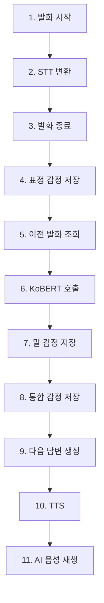

# DearMind API 사용 가이드

## 📋 목차
1. [개요](#개요)
2. [기본 설정](#기본-설정)
3. [핵심 플로우](#핵심-플로우)
4. [API 엔드포인트](#api-엔드포인트)
5. [프론트엔드 통합 예시](#프론트엔드-통합-예시)
6. [에러 처리](#에러-처리)
7. [테스트 방법](#테스트-방법)

## 개요

DearMind는 AI와의 대화를 통한 회상요법 서비스를 제공하는 백엔드 API입니다. 
사용자가 질문을 선택하고 AI와 대화한 후, 대화 내용을 바탕으로 일기와 음악 추천을 제공합니다.

### 주요 기능
- **질문 목록 조회**: 회상요법 질문들 조회
- **통합 대화 시작**: 카메라/마이크 세션 + 대화방 생성
- **단계별 음성 대화**: 발화 시작 → 표정 감정 분석 → 발화 종료 → STT → 말 감정 분석 → 통합 감정 → GPT 응답 → TTS
- **감정 분석**: 표정 및 음성 감정 분석
- **일기 생성**: 대화 내용 기반 일기 자동 생성
- **음악 추천**: 감정 기반 음악 추천

## 기본 설정

### Base URL
- **로컬 개발**: `http://localhost:8080/api`
- **운영 환경**: `https://your-domain.com/api`

### Swagger UI
- **로컬**: `http://localhost:8080/swagger-ui.html`
- **운영**: `https://your-domain.com/swagger-ui.html`

### Content-Type
모든 API 요청은 `application/json` 형식을 사용합니다.

## 핵심 플로우

### 발화 플로우 (한 번의 대화)


### 전체 대화 플로우
1. **질문 목록 조회** → **대화 시작**
2. **발화 플로우** (위 11단계) 반복
3. **대화 종료** → **일기 생성** → **일기 조회**

## API 엔드포인트

### 1. 질문 목록 조회

#### 엔드포인트
```
GET /api/questions
```

#### 응답
```json
{
  "status": "success",
  "questions": [
    {
      "id": 1,
      "content": "어린 시절 가장 기억에 남는 놀이는 무엇인가요?"
    },
    {
      "id": 2,
      "content": "처음으로 직장에 다니게 되었을 때의 기분은 어땠나요?"
    }
  ],
  "count": 20
}
```

### 2. 대화 시작 (통합 API) ⭐

#### 엔드포인트
```
POST /api/conversations/start
```

#### 요청
```json
{
  "userId": "user123",
  "questionId": 5
}
```

#### 응답
```json
{
  "conversationId": 1,
  "cameraSessionId": "cam_123",
  "microphoneSessionId": "mic_456",
  "status": "ACTIVE",
  "question": {
    "id": 5,
    "content": "어린 시절 가장 기억에 남는 놀이는 무엇인가요?"
  },
  "message": "대화가 성공적으로 시작되었습니다."
}
```

### 3. 발화 시작

#### 엔드포인트
```
POST /api/microphone/speech/start
```

#### 요청
```json
{
  "microphoneSessionId": "mic_456",
  "cameraSessionId": "cam_123",
  "userId": "user123"
}
```

#### 응답
```json
{
  "status": "success",
  "message": "발화가 시작되었습니다.",
  "microphoneSessionId": "mic_456",
  "cameraSessionId": "cam_123",
  "userId": "user123"
}
```

### 4. 발화 종료

#### 엔드포인트
```
POST /api/microphone/speech/end
```

#### 요청
```json
{
  "userId": "user123",
  "microphoneSessionId": "mic_456",
  "cameraSessionId": "cam_123",
  "conversationId": 1,
  "audioData": "base64_encoded_audio_data"
}
```

#### 응답
```json
{
  "status": "success",
  "message": "발화가 종료되었습니다.",
  "conversationMessageId": 123,
  "userText": "어릴 때 자주 했던 놀이는 숨바꼭질이었어요.",
  "microphoneSessionId": "mic_456",
  "cameraSessionId": "cam_123",
  "userId": "user123",
  "conversationId": 1
}
```

### 6. 표정 감정 분석 저장

#### 엔드포인트
```
POST /api/emotion-analysis/facial
```

#### 요청
```json
{
  "conversationMessageId": 123,
  "finalEmotion": "기쁨",
  "totalCaptures": 5,
  "emotionCounts": {
    "기쁨": 3,
    "중립": 2
  },
  "averageConfidence": 0.85,
  "captureDetails": [
    {
      "timestamp": "2024-01-15T10:30:01",
      "emotion": "기쁨",
      "confidence": 0.92
    },
    {
      "timestamp": "2024-01-15T10:30:04",
      "emotion": "기쁨",
      "confidence": 0.78
    }
  ]
}
```

#### 응답
```json
{
  "id": 1,
  "conversationMessageId": 123,
  "facialEmotion": "기쁨",
  "facialConfidence": 0.85,
  "totalCaptures": 5,
  "emotionCounts": {
    "기쁨": 3,
    "중립": 2
  },
  "averageConfidence": 0.85,
  "captureDetails": [...],
  "createdAt": "2024-01-15T10:30:10"
}
```

### 7. 이전 발화 조회

#### 엔드포인트
```
GET /api/conversations/context/{conversationMessageId}
```

#### 응답
```json
{
  "success": true,
  "conversationId": 1,
  "conversationMessageId": 123,
  "prevUser": "안녕하세요!",
  "prevSys": "안녕하세요! 오늘은 어떤 이야기를 나누고 싶으신가요?",
  "currUser": "어릴 때 자주 했던 놀이는 숨바꼭질이었어요."
}
```

### 8. 말 감정 분석 저장

#### 엔드포인트
```
POST /api/emotion-analysis/speech
```

#### 요청
```json
{
  "conversationMessageId": 123,
  "emotion": "기쁨",
  "confidence": 0.78,
  "speechEmotionData": "{\"emotion\":\"기쁨\",\"confidence\":0.78,\"details\":{}}"
}
```

#### 응답
```json
{
  "id": 1,
  "conversationMessageId": 123,
  "facialEmotion": null,
  "speechEmotion": "{\"emotion\":\"기쁨\",\"confidence\":0.78}",
  "combinedEmotion": null,
  "combinedConfidence": null,
  "analysisTimestamp": "2024-01-15T10:30:15"
}
```

### 9. 통합 감정 저장

#### 엔드포인트
```
POST /api/emotion-analysis/combine
```

#### 요청
```json
{
  "conversationMessageId": 123
}
```

#### 응답
```json
{
  "id": 1,
  "conversationMessageId": 123,
  "facialEmotion": "기쁨",
  "facialConfidence": 0.85,
  "speechEmotion": "기쁨",
  "speechConfidence": 0.78,
  "combinedEmotion": "기쁨",
  "combinedConfidence": 0.82,
  "createdAt": "2024-01-15T10:30:20"
}
```

### 10. 다음 답변 생성

#### 엔드포인트
```
POST /api/gpt/generate
```

#### 요청
```json
{
  "conversationMessageId": 123
}
```

#### 응답
```json
{
  "aiResponse": "정말 흥미로운 이야기네요! 그 놀이를 할 때 어떤 기분이었나요?",
  "emotionInfo": "기쁨 (82%)",
  "conversationMessageId": 123,
  "savedAIMessageId": 124
}
```

### 11. TTS 변환

#### 엔드포인트
```
POST /api/tts/synthesize
```

#### 요청
```json
{
  "text": "정말 흥미로운 이야기네요! 그 놀이를 할 때 어떤 기분이었나요?",
  "voice": "ko-KR-Wavenet-A",
  "speed": 1.0,
  "pitch": 0.0,
  "volume": 0.0,
  "format": "MP3"
}
```

#### 응답
```json
{
  "audioBase64": "base64_encoded_tts_audio",
  "format": "mp3",
  "voice": "ko-KR-Wavenet-A",
  "speed": 1.0,
  "status": "success",
  "message": "TTS 변환이 완료되었습니다."
}
```

### 12. 대화 종료

#### 엔드포인트
```
PUT /api/conversations/{conversationId}/end
```

#### 응답
```json
{
  "conversationId": 1,
  "status": "COMPLETED",
  "processingStatus": "PROCESSING",
  "messages": [
    {
      "id": 1,
      "content": "어릴 때 자주 했던 놀이는 숨바꼭질이었어요.",
      "senderType": "USER",
      "createdAt": "2024-01-15T10:30:00"
    },
    {
      "id": 2,
      "content": "정말 흥미로운 이야기네요! 그 놀이를 할 때 어떤 기분이었나요?",
      "senderType": "AI",
      "createdAt": "2024-01-15T10:30:05"
    }
  ],
  "message": "일기 생성 중입니다..."
}
```

### 13. 처리 상태 확인

#### 엔드포인트
```
GET /api/conversations/{conversationId}/processing-status
```

#### 응답
```json
{
  "conversationId": 1,
  "status": "COMPLETED",
  "summaryCompleted": true,
  "diaryCompleted": true,
  "message": "처리가 완료되었습니다.",
  "success": true
}
```

### 14. 일기 조회

#### 엔드포인트
```
GET /api/conversations/{conversationId}/diary
```

#### 응답
```json
{
  "conversationId": 1,
  "summary": "사용자가 어린 시절 숨바꼭질 놀이에 대한 추억을 나누었습니다.",
  "diary": "오늘은 어린 시절의 소중한 추억에 대해 이야기했습니다...",
  "emotionSummary": {
    "dominantEmotion": "기쁨",
    "averageConfidence": 0.82,
    "analyzedMessageCount": 3,
    "emotionCounts": {
      "기쁨": 2,
      "그리움": 1
    }
  },
  "musicRecommendations": [
    {
      "id": 1,
      "title": "어린 시절",
      "artist": "김광석",
      "mood": "그리움",
      "youtubeLink": "https://www.youtube.com/watch?v=example",
      "youtubeVideoId": "example"
    }
  ],
  "message": "일기를 성공적으로 조회했습니다."
}
```

## 프론트엔드 통합 예시

### React Native 예시

```javascript
// API 서비스 클래스
class DearMindAPI {
  constructor(baseURL = 'http://localhost:8080/api') {
    this.baseURL = baseURL;
  }

  async request(endpoint, options = {}) {
    const url = `${this.baseURL}${endpoint}`;
    const config = {
      headers: {
        'Content-Type': 'application/json',
        ...options.headers,
      },
      ...options,
    };

    try {
      const response = await fetch(url, config);
      const data = await response.json();
      
      if (!response.ok) {
        throw new Error(data.message || 'API 요청 실패');
      }
      
      return data;
    } catch (error) {
      console.error('API Error:', error);
      throw error;
    }
  }

  // 1. 질문 목록 조회
  async getQuestions() {
    return this.request('/questions');
  }

  // 2. 대화 시작 (통합)
  async startConversation(userId, questionId) {
    return this.request('/conversations/start', {
      method: 'POST',
      body: JSON.stringify({ userId, questionId }),
    });
  }

  // 3. 발화 시작
  async startSpeech(microphoneSessionId, cameraSessionId, userId) {
    return this.request('/microphone/speech/start', {
      method: 'POST',
      body: JSON.stringify({
        microphoneSessionId,
        cameraSessionId,
        userId,
      }),
    });
  }

  // 4. 표정 감정 분석 저장
  async saveFacialEmotionAnalysis(data) {
    return this.request('/emotion-analysis/facial', {
      method: 'POST',
      body: JSON.stringify(data),
    });
  }

  // 5. 발화 종료 (STT만)
  async endSpeech(microphoneSessionId, cameraSessionId, userId, audioData) {
    return this.request('/microphone/speech/end', {
      method: 'POST',
      body: JSON.stringify({
        microphoneSessionId,
        cameraSessionId,
        userId,
        audioData,
      }),
    });
  }

  // 6. 이전 발화 조회
  async getConversationContext(conversationMessageId) {
    return this.request(`/conversations/context/${conversationMessageId}`);
  }

  // 7. 말 감정 분석 저장
  async saveSpeechEmotionAnalysis(data) {
    return this.request('/emotion-analysis/speech', {
      method: 'POST',
      body: JSON.stringify(data),
    });
  }

  // 8. 통합 감정 저장
  async combineEmotions(conversationMessageId) {
    return this.request('/emotion-analysis/combine', {
      method: 'POST',
      body: JSON.stringify({ conversationMessageId }),
    });
  }

  // 9. 다음 답변 생성
  async generateEmotionBasedResponse(conversationMessageId) {
    return this.request('/gpt/generate', {
      method: 'POST',
      body: JSON.stringify({ conversationMessageId }),
    });
  }

  // 10. TTS 변환
  async convertToSpeech(text, voice = 'ko-KR-Wavenet-A') {
    return this.request('/tts/synthesize', {
      method: 'POST',
      body: JSON.stringify({
        text,
        voice,
        speed: 1.0,
        pitch: 0.0,
        volume: 0.0,
        format: 'MP3',
      }),
    });
  }

  // 11. 대화 종료
  async endConversation(conversationId) {
    return this.request(`/conversations/${conversationId}/end`, {
      method: 'PUT',
    });
  }

  // 12. 처리 상태 확인
  async getProcessingStatus(conversationId) {
    return this.request(`/conversations/${conversationId}/processing-status`);
  }

  // 13. 일기 조회
  async getDiary(conversationId) {
    return this.request(`/conversations/${conversationId}/diary`);
  }
}

// 사용 예시
const api = new DearMindAPI();

// 발화 플로우 (한 번의 대화)
async function speechFlow(microphoneSessionId, cameraSessionId, userId) {
  try {
    // 1. 발화 시작
    await api.startSpeech(microphoneSessionId, cameraSessionId, userId);
    
    // 2. 표정 감정 분석 저장 (카메라 캡쳐 + YOLO API 결과)
    const facialEmotionData = await analyzeFacialEmotions(); // YOLO API 호출
    await api.saveFacialEmotionAnalysis({
      conversationMessageId: messageId,
      finalEmotion: facialEmotionData.dominant,
      totalCaptures: facialEmotionData.total,
      emotionCounts: facialEmotionData.counts,
      averageConfidence: facialEmotionData.avgConfidence,
      captureDetails: facialEmotionData.details
    });
    
    // 3. 발화 종료 (STT만)
    const audioData = 'base64_encoded_audio'; // 실제 오디오 데이터
    const endResponse = await api.endSpeech(microphoneSessionId, cameraSessionId, userId, audioData);
    const userText = endResponse.userText; // STT 결과
    
    // 4. 이전 발화 조회
    const context = await api.getConversationContext(endResponse.conversationMessageId);
    
    // 5. KoBERT 호출 (외부 API)
    const speechEmotionData = await analyzeSpeechEmotion(userText); // KoBERT API 호출
    
    // 6. 말 감정 분석 저장
    await api.saveSpeechEmotionAnalysis({
      conversationMessageId: endResponse.conversationMessageId,
      emotion: speechEmotionData.emotion,
      confidence: speechEmotionData.confidence,
      speechEmotionData: speechEmotionData.data
    });
    
    // 7. 통합 감정 저장
    await api.combineEmotions(endResponse.conversationMessageId);
    
    // 8. 다음 답변 생성
    const gptResponse = await api.generateEmotionBasedResponse(endResponse.conversationMessageId);
    
    // 9. TTS 변환
    const ttsResponse = await api.convertToSpeech(gptResponse.aiResponse);
    
    // 10. AI 음성 재생
    playAudio(ttsResponse.audioBase64);
    
    return gptResponse;
    
  } catch (error) {
    console.error('발화 플로우 오류:', error);
    throw error;
  }
}

// 전체 대화 플로우
async function startConversationFlow() {
  try {
    // 1. 질문 목록 조회
    const questionsResponse = await api.getQuestions();
    const questions = questionsResponse.questions;
    
    // 2. 사용자가 질문 선택 (예: 첫 번째 질문)
    const selectedQuestion = questions[0];
    
    // 3. 대화 시작
    const startResponse = await api.startConversation('user123', selectedQuestion.id);
    const { conversationId, cameraSessionId, microphoneSessionId } = startResponse;
    
    // 4. 발화 플로우 반복 (사용자가 대화를 계속하는 동안)
    let continueConversation = true;
    while (continueConversation) {
      const gptResponse = await speechFlow(microphoneSessionId, cameraSessionId, 'user123');
      
      // 사용자가 대화를 계속할지 결정 (UI에서 처리)
      continueConversation = await askUserToContinue();
    }
    
    // 5. 대화 종료
    await api.endConversation(conversationId);
    
    // 6. 일기 생성 완료까지 대기 (폴링)
    let processingComplete = false;
    while (!processingComplete) {
      const statusResponse = await api.getProcessingStatus(conversationId);
      if (statusResponse.status === 'COMPLETED') {
        processingComplete = true;
      } else {
        await new Promise(resolve => setTimeout(resolve, 2000)); // 2초 대기
      }
    }
    
    // 7. 일기 조회
    const diaryResponse = await api.getDiary(conversationId);
    console.log('생성된 일기:', diaryResponse.diary);
    console.log('음악 추천:', diaryResponse.musicRecommendations);
    
  } catch (error) {
    console.error('대화 플로우 오류:', error);
  }
}

// 외부 API 호출 함수들 (프론트엔드에서 구현)
async function analyzeFacialEmotions() {
  // YOLO API 호출 로직
  // 카메라에서 캡쳐한 이미지들을 YOLO API로 전송
  // 결과를 통합하여 최종 감정 도출
  return {
    dominant: '기쁨',
    total: 5,
    counts: { '기쁨': 3, '중립': 2 },
    avgConfidence: 0.85,
    details: [...]
  };
}

async function analyzeSpeechEmotion(text) {
  // KoBERT API 호출 로직
  // STT로 변환된 텍스트를 KoBERT API로 전송
  return {
    emotion: '기쁨',
    confidence: 0.78,
    data: {...}
  };
}

// 오디오 재생 함수
function playAudio(base64Audio) {
  const audio = new Audio(`data:audio/mp3;base64,${base64Audio}`);
  audio.play();
}

// 사용자에게 대화 계속 여부 확인
async function askUserToContinue() {
  // UI에서 사용자에게 대화 계속 여부를 묻는 로직
  return true; // 예시
}
```

### JavaScript/Web 예시

```javascript
// YouTube 플레이어 설정 (일기 페이지에서)
function setupYouTubePlayer(videoId) {
  const player = new YT.Player('player', {
    height: '200',
    width: '100%',
    videoId: videoId,
    playerVars: {
      autoplay: 0,
      controls: 1,
    },
    events: {
      'onReady': onPlayerReady,
      'onStateChange': onPlayerStateChange
    }
  });
}
```

## 추가 API 참조

위 13개 핵심 API 외에도 다음과 같은 API들이 제공됩니다:

### 감정 분석 조회 API
- `GET /api/emotion-analysis/message/{conversationMessageId}` - 특정 메시지의 감정 분석 결과 조회
- `GET /api/emotion-analysis/conversation/{conversationId}` - 대화 세션의 모든 감정 분석 결과 조회
- `GET /api/emotion-analysis/emotion/{emotion}` - 특정 감정으로 필터링된 결과 조회
- `GET /api/emotion-analysis/confidence` - 신뢰도 범위로 필터링된 결과 조회

### GPT & TTS 개별 API
- `POST /api/gpt/test` - GPT API 테스트
- `GET /api/gpt/emotion-test` - 감정 기반 대화 테스트
- `POST /api/gpt/conversation-summary` - 대화 내용 요약
- `POST /api/tts/simple` - 간단한 TTS 변환

### 대화 관리 API
- `GET /api/conversations/{id}` - 대화 세션 조회
- `GET /api/conversations/user/{userId}` - 사용자별 대화 목록
- `GET /api/conversations/user/{userId}/active` - 활성 대화 조회
- `GET /api/conversations/{id}/messages` - 대화 메시지 목록
- `POST /api/conversations/{id}/messages/user` - 사용자 메시지 저장
- `POST /api/conversations/{id}/messages/ai` - AI 메시지 저장
- `PUT /api/conversations/{id}/status` - 대화 상태 업데이트

### 카메라/마이크 세션 관리 API
- `POST /api/camera/session` - 카메라 세션 생성
- `GET /api/camera/session/{sessionId}` - 카메라 세션 조회
- `PUT /api/camera/session/{sessionId}/status` - 카메라 세션 상태 업데이트
- `DELETE /api/camera/session/{sessionId}` - 카메라 세션 종료
- `POST /api/microphone/session` - 마이크 세션 생성
- `GET /api/microphone/session/{sessionId}` - 마이크 세션 조회
- `PUT /api/microphone/session/{sessionId}/status` - 마이크 세션 상태 업데이트
- `DELETE /api/microphone/session/{sessionId}` - 마이크 세션 종료

### 개발/테스트 API
- `POST /api/conversations/dummy/{userId}` - 더미 데이터 생성
- `GET /api/questions/random` - 랜덤 질문 조회
- `GET /api/questions/{id}` - 특정 질문 조회
- `GET /api/questions/count` - 질문 개수 조회

**전체 API 목록과 상세 정보는 Swagger UI에서 확인하세요:**
- 로컬: `http://localhost:8080/swagger-ui.html`
- 운영: `https://your-domain.com/swagger-ui.html`

## 에러 처리

### 일반적인 에러 응답 형식

```json
{
  "status": "error",
  "message": "에러 메시지",
  "timestamp": "2024-01-15T10:30:00"
}
```

### HTTP 상태 코드

- **200**: 성공
- **400**: 잘못된 요청 (필수 파라미터 누락, 잘못된 형식)
- **404**: 리소스를 찾을 수 없음
- **500**: 서버 내부 오류

### 에러 처리 예시

```javascript
try {
  const response = await api.startConversation('user123', 5);
  // 성공 처리
} catch (error) {
  if (error.message.includes('존재하지 않는 질문')) {
    // 질문 ID 오류 처리
    showError('선택한 질문을 찾을 수 없습니다.');
  } else if (error.message.includes('사용자 ID는 필수')) {
    // 사용자 ID 오류 처리
    showError('사용자 정보가 필요합니다.');
  } else {
    // 일반 오류 처리
    showError('서버 오류가 발생했습니다. 잠시 후 다시 시도해주세요.');
  }
}
```

## 테스트 방법

### 1. Swagger UI 사용
1. `http://localhost:8080/swagger-ui.html` 접속
2. 각 API 엔드포인트 클릭
3. "Try it out" 버튼 클릭
4. 요청 데이터 입력 후 "Execute" 클릭

### 2. cURL 명령어

```bash
# 질문 목록 조회
curl -X GET "http://localhost:8080/api/questions"

# 대화 시작
curl -X POST "http://localhost:8080/api/conversations/start" \
  -H "Content-Type: application/json" \
  -d '{"userId": "user123", "questionId": 1}'

# 발화 시작
curl -X POST "http://localhost:8080/api/microphone/speech/start" \
  -H "Content-Type: application/json" \
  -d '{"microphoneSessionId": "mic_456", "cameraSessionId": "cam_123", "userId": "user123"}'
```

### 3. 테스트 데이터 생성

```bash
# 더미 대화 데이터 생성
curl -X POST "http://localhost:8080/api/conversations/dummy/user123"
```

## 주의사항

1. **음성 데이터**: Base64로 인코딩하여 전송
2. **세션 관리**: 각 대화마다 고유한 세션 ID 사용
3. **폴링**: 일기 생성 완료까지 2초 간격으로 상태 확인
4. **에러 처리**: 모든 API 호출에 적절한 에러 처리 구현
5. **CORS**: 개발 환경에서 CORS 설정 확인

